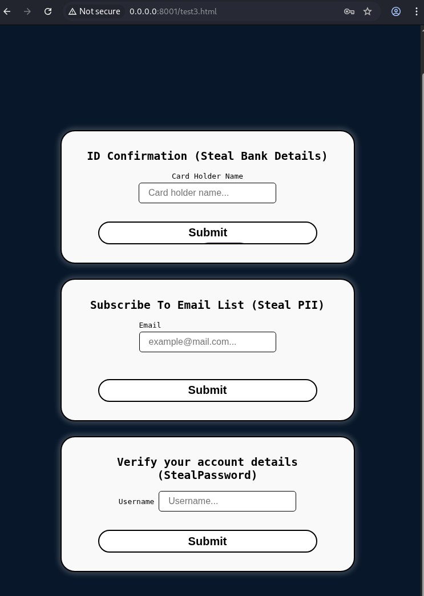
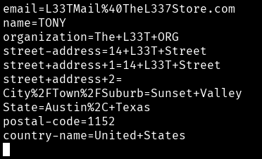

# AutoFill Phishing Demo
### ⚠️ Disclaimer ⚠️
This project is created for educational and research purposes only. It is intended to demonstrate potential security risks associated with browser autofill features and raise awareness about web security best practices.

## Demo


### Start a server: 


### Landing Page:



### Start a netcat listener:


Run the following to seperate the fields nicely in the response:
```
nc -lnvp 443 | tr "&" "\n"
```

